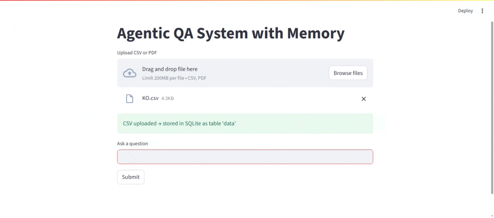

# 🧠 Agentic QA System with Memory

An end-to-end **LLM-powered Agentic Question Answering System** that combines:

- 🔎 Retrieval-Augmented Generation (RAG)
- 🗄 SQL Tool Execution
- 🧮 Calculator Tool
- 🧠 Persistent Vector Memory
- ⚙️ Tool-based Planning & Execution
- 🌐 FastAPI Backend
- 💬 Streamlit UI

This project demonstrates real-world **GenAI system design** beyond basic chatbots by integrating planning, tool usage, and memory.

---

## 🚀 Features

✔ Multi-tool agent (RAG + SQL + Calculator)  
✔ Query planning system  
✔ Vector-based long-term memory  
✔ FAISS-based semantic search  
✔ REST API using FastAPI  
✔ Interactive UI using Streamlit  
✔ Modular and production-ready structure  

---


## 🏗️ System Architecture

User Query
   │
   ▼
Planner (Decides Tools)
   │
   ▼
Tool Executor
   │
   ├── RAG (Vector DB Retrieval)
   ├── SQL Tool (Database Queries)
   ├── Calculator Tool (Math Operations)
   └── Memory Retrieval (Vector DB)
   │
   ▼
Final LLM Response 

---
## demo


## ⚙️ Installation

### 1️⃣ Clone the repository

```bash
git clone https://github.com/yourusername/agentic-multi-tool-qa.git
cd agentic-multi-tool-qa
```

### 2️⃣ Create Virtual Environment (Recommended)
```bash
py -m venv venv
venv\Scripts\activate   # Windows
# OR
source venv/bin/activate  # Mac/Linux
```

### 3️⃣ Install Dependencies
```bash
py -m pip install -r requirements.txt
```
```bash
py -m pip install fastapi uvicorn streamlit sentence-transformers faiss-cpu numpy
```
### ▶️ Running the Project
```bash
py -m uvicorn app:app --reload
```
```bash
http://127.0.0.1:8000
```
```bash
http://127.0.0.1:8000/docs
```
### 🔹 Start Frontend (Streamlit UI)
```bash
py -m streamlit_app.py
```

---
